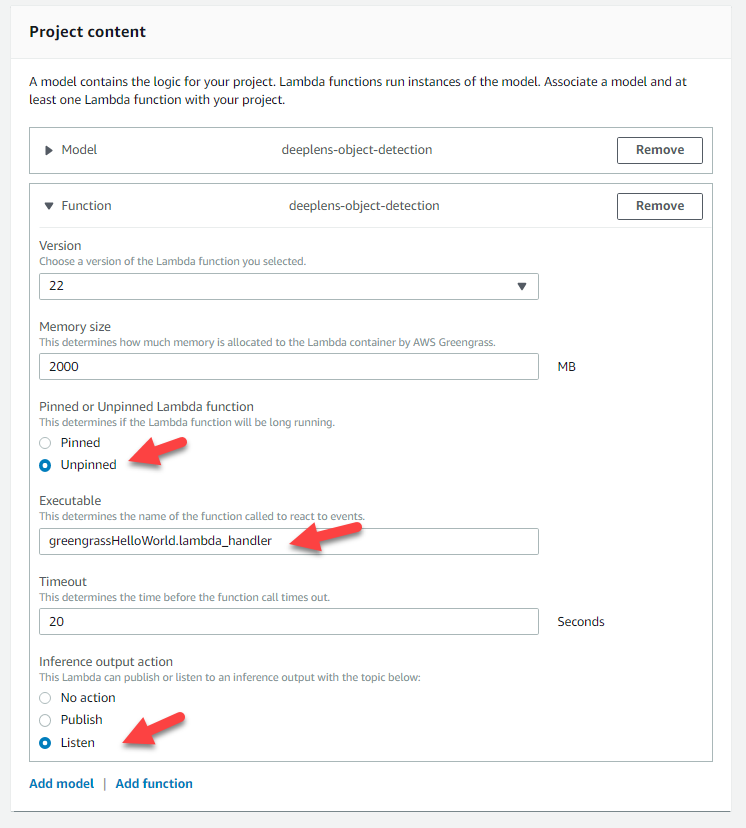
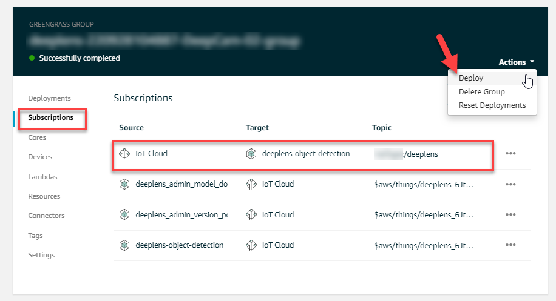

Realtime DeepLens web app using React, AWS API Gateway Websockets, Dynamodb and custom Cognito authorizer.

The DeepLens device is triggered from an action taken in the cloud vs continously running inference.

## Stack

- AWS DeepLens
- AWS Cognito
- AWS Lambda
- AWS WebSocket API
- AWS DynamoDB
- React 16.8+
- Sockette
- Serverless 1.38+

## Register DeepLens

> Follow the AWS Documentation: 
> https://docs.aws.amazon.com/deeplens/latest/dg/deeplens-getting-started-register.html

- Use one of the sample project such as the object detection model
- Replace the lambda with the one provided in this project.
- Add an AWS Greengrass subscription in order to trigger the DeepLens manually.

### Configure Project

- Select Unpinned
- Confirm the executable points to the lambda handler



### Configure Lambda Trigger

Create a subscription from `IoT Cloud` to `AWS Inference Lambda` with a specific topic. This allows the inference to be done on-demand.

> This subscription is cleared each time the DeepLens project is deployed.
> Remember to deploy this subscription after adding it.



## Create AWS Cognito User Pool

https://docs.aws.amazon.com/cognito/latest/developerguide/tutorial-create-user-pool.html

Once User Pool is created, set the environment variables accordingly. The APP client id is used both in the react application and in the authorzerFunc.

## Deploy Backend

- Update the `iotTopic` variable in [serverless.yml](backend/serverless.yml) with the AWS DeepLens inference topic.
- Once the backend is deployed, update the `sendMessage` lambda's environment variable `WSAPI_NAME` and replace `__UPDATE__` with the websocket API's url. This should be handled more gracefully...

```bash
cd backend
serverless deploy
cd ..
```

## Configure environment

Create a .env.local file in the `frontend` folder in order to run the React application.

```
REACT_APP_USER_POOL_ID={AWS cognito user pool id}
REACT_APP_USER_POOL_CLIENT_ID={AWS cognito app client id}
REACT_APP_WS_API_NAME={websocket api url}
```

## Run React App

```bash
cd frontend
npm install
npm start
```

## Trigger Deeplens

In AWS IoT, publish a message to the custom topic created for the greengrass subscription.